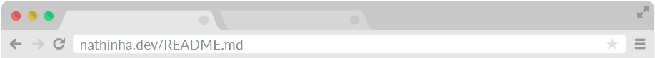

<header>
  
  <h2 style="margin-left: 5%; margin-bottom: 0%">
    Nathalia Pinheiro 
    
  </h2>
  <h4 style="color: #bcbcbc; margin: 0% 5% 5%">Desenvolvedora Web</h4>
</header>

<main style="margin: 5%">
  <h5 style="color: #efc3e6">Sobre</h5>

  
Sou formada no bacharelado de sistemas de informação e atuo como desenvolvedora web: gosto de fazer coisas bonitas e por isso trabalho com front-end! ✨

  <h5 style="color: #efc3e6">Estudos</h5>

  - 📖 Atualmente estou lendo/aprendendo sobre código limpo, animações CSS e um pouco mais sobre React (não necessariamente nessa ordem)

  <h5 style="color: #efc3e6">Me encontre</h5>

  - 📫 Me encontre no <a href="https://www.linkedin.com/in/nathalia-pinheiro" style="color: #F0A6CA">Linkedin</a> e no <a href="https://twitter.com/nathi_pinheiro" style="color: #F0A6CA" title="@nathi_pinheiro">Twitter</a>

  <h5 style="color: #efc3e6"> Pronomes </h5>

  - 😄 ela | dela

</main>
